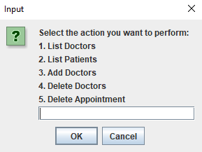
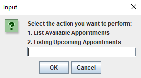
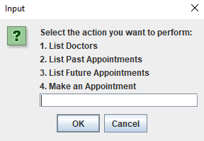
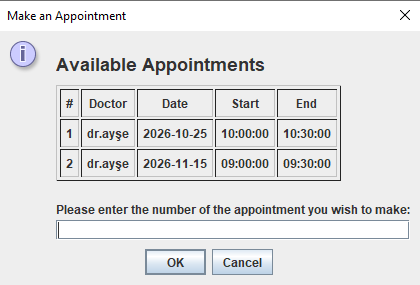

# HOSPITAL APPOINTMENT SYSTEM
## Description
This project is a desktop-based Hospital Appointment System developed using Java Swing and MySQL. It allows users (admin, doctor, and patient) to log in, access role-specific interfaces, and manage appointments accordingly.

## Features
• Login System:  
Login available for Admin, Doctor, and Patient roles.

• Role-Based Access:  
Admin: Manage users (add/delete/list doctors and patients).
Doctor: View their own appointments, add comments (if applicable).
Patient: Book and cancel appointments, view past and upcoming appointments.

• Appointment Management:  
View all available appointments
Filter by past and future appointments
Prevent scheduling conflicts through overlap control

• User Interface:  
Built with a user-friendly Java Swing GUI

## Technologies Used  
Java – Core programming language  
Java Swing – Desktop GUI framework  
MySQL – Relational database system

## Screenshots
 

## Installation & Setup
Requirements  
• JDK 8 or above  
• MySQL Server  
• JDBC Driver (mysql-connector-java)

Steps
1. Clone or download the project.
2. Create a MySQL database named hospital_management.
3. Execute the database.sql file to create the required tables and sample data.
4. Update the database connection details in the DBConnection.java file.
5. Run the project via Main.java.
